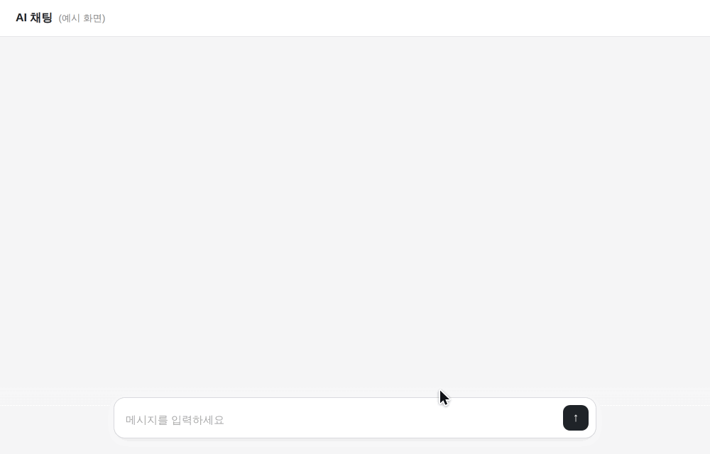

<div align="center">


# 가림 (Garim)

**ChatGPT·Claude·Gemini에 붙여넣기 전, 개인정보는 가리고 — AI 답변은 원래대로 되돌리는 도구**

[바로 사용하기 → fillddak.github.io/garim](https://fillddak.github.io/garim/)

서버 전송 0 · 완전 오프라인 · 설치/로그인 없음 · 오픈소스

</div>

---

## 왜 만들었나요?

업무 메일을 다듬고, 고객 문의에 답하고, 계약서를 요약하고, 에러 로그를 디버깅할 때 우리는 매일 AI에 글을 붙여넣습니다.
그 글 안에는 **고객 이름, 주민등록번호, 전화번호, 주소, 계좌번호, 사내 API 키**가 그대로 들어 있습니다.

기존 방법은 둘 중 하나였습니다.

- 손으로 하나하나 지우기 → 느리고, 빠뜨리고, AI 답변에 다시 채워 넣어야 함
- 서버형 마스킹 서비스 → 가리려고 **또 다른 서버에 개인정보를 보냄**

가림은 **브라우저 안에서만** 개인정보를 찾아 `[이름_1]`, `[전화_1]` 같은 자리표시자로 바꾸고,
AI가 준 답변을 붙여넣으면 **자리표시자를 원래 값으로 되돌려** 줍니다. 한국 개인정보 형식(주민번호 체크섬, 사업자번호, 계좌 문맥, 도로명 주소, 한국 이름)에 맞춰 설계했습니다.

```
원문   : 김민수 과장님(010-1234-5678)께 950314-2345678 서류 전달 부탁드려요
AI에게 : [이름_1] 과장님([전화_1])께 [주민번호_1] 서류 전달 부탁드려요
AI 답변: [이름_1] 과장님께 보낼 메일 초안입니다 …
되돌리기: 김민수 과장님께 보낼 메일 초안입니다 …
```

### 이렇게 동작해요

**텍스트 가리기 → AI 답변 되돌리기**

<p align="center"><picture><source media="(max-width: 700px)" srcset="public/demo/m-text.gif" /></picture></p>

**캡처·사진 속 개인정보 가리기**

<p align="center"><picture><source media="(max-width: 700px)" srcset="public/demo/m-image.gif" /></picture></p>

**브라우저 확장: 붙여넣는 순간 자동으로**

<p align="center"></p>

<sub>예시 속 이름·번호는 모두 지어낸 값입니다.</sub>

## 주요 기능

| 기능 | 설명 |
| --- | --- |
| **텍스트 가리기** | 붙여넣는 즉시 개인정보를 색깔별로 표시하고 가린 결과를 실시간으로 보여 줍니다. 항목별로 켜고 끄기, 드래그로 직접 가리기, 클립보드 원클릭(`Ctrl+Shift+V`) |
| **3가지 방식** | `자리표시자` [이름_1] · `가짜 값` 김가온/010-0000-1001 (자연스러운 문장) · `영구 가림` 김\*수/010-\*\*\*\*-5678 (공유용) |
| **되돌리기** | AI가 `[이름 1]`, `【이름_1】`, `이름_1`처럼 표기를 바꿔도 찾아서 복원. 세션에 없는 표시는 경고 |
| **문서** | Word·Excel·PowerPoint·**한글(HWPX)** 서식을 유지한 채 글자만 교체, 작성자 등 문서 속성·미리보기 이미지도 제거. **PDF**는 복원 불가능한 이미지 PDF로 재생성(스캔본은 OCR로 자동 가림). CSV/TXT는 EUC-KR(CP949) 자동 인식 |
| **이미지** | 캡처·사진·신분증·등록증에서 한국어 OCR로 (기울기·원근 자동 보정, **얼굴 자동 가림**) 개인정보 위치를 찾아 박스를 씌움. 드래그로 추가·이동·크기 조절, 두 손가락(또는 Ctrl+휠)으로 확대, 검은 박스/흰 박스/모자이크/흐림, QR 코드 감지(지원 브라우저), EXIF 위치정보 제거 |
| **내 사전·허용 목록** | 회사명·프로젝트명은 항상 가리고, 대표번호처럼 괜찮은 값은 절대 가리지 않도록 |
| **복원 키 보관함** | 가린 값의 연결 정보는 이 기기에만 저장, 기본 24시간 후 자동 삭제. JSON 내보내기/불러오기 |
| **브라우저 확장** | ChatGPT·Claude·Gemini·Perplexity·Copilot·뤼튼·클로바X 입력창에 **붙여넣는 순간 자동으로 가림**, AI 답변 속 자리표시자는 내 화면에서만 원래 값으로 표시, 답변을 복사하면 원래 값으로 복사 (크롬·엣지·웨일) |
| **PWA** | 앱으로 설치하면 비행기 모드에서도 동작. 안드로이드 공유 메뉴에서 사진·글을 바로 가림으로 보내기 |

### 찾아내는 정보 (17종)

이름 · 주민등록번호(체크섬) · 외국인등록번호 · 휴대전화/유선/070/+82 · 이메일 · 도로명/지번 주소와 동·호수 · 계좌번호(은행 문맥) · 카드번호(Luhn) · 생년월일 · 사업자등록번호(체크섬) · 법인등록번호(체크섬) · 여권번호 · 운전면허번호 · 차량번호 · IP 주소 · **API 키/비밀번호**(OpenAI, Anthropic, AWS, GitHub, Google, Slack, Stripe, JWT, DB 접속 URL, `password=`, Bearer 토큰 등) · 토큰이 담긴 URL

이름은 규칙만으로 찾기 어려워 여러 단서를 함께 씁니다: `성명:` 같은 항목명, `과장님/씨/고객` 같은 호칭, 전화번호·주민번호 **바로 옆에 적힌 이름**, 그리고 한 번 찾은 이름은 문서 전체에서 다시 찾아 가립니다.

## 브라우저 확장 설치

1. [사이트](https://fillddak.github.io/garim/#/guide)에서 `확장 프로그램 받기`로 zip을 받아 압축을 풉니다. (직접 빌드: `npm run build:extension` → `extension/dist`)
2. `chrome://extensions` · `edge://extensions` · `whale://extensions` 를 엽니다.
3. **개발자 모드**를 켜고 **압축해제된 확장 프로그램을 로드**에서 폴더를 선택합니다.
4. 이미 열려 있던 AI 사이트 탭은 새로고침해야 동작합니다. (확장 아이콘 팝업에서 현재 탭의 동작 여부를 확인할 수 있어요)

## 개인정보는 어디로도 가지 않습니다

- 서버가 없는 정적 사이트입니다. 모든 처리는 브라우저의 자바스크립트/WebAssembly로 이뤄집니다.
- 페이지에 `connect-src 'self'` **Content-Security-Policy**가 적용되어, 페이지의 어떤 코드도 다른 주소로 데이터를 보낼 수 없습니다.
- 글꼴, OCR 엔진(Tesseract), 한국어 인식 모델, PDF 엔진까지 **모두 같은 사이트에서 제공**합니다. 외부 CDN 호출이 없습니다.
- 직접 확인: 페이지를 연 뒤 인터넷을 끄고 사용해 보세요.

> 가림은 실수를 줄여 주는 도구이며 법적 비식별 조치를 보증하지 않습니다. 보내기 전에 결과를 확인해 주세요.

## 개발

```bash
npm install
npm run dev      # 개발 서버 (OCR·PDF 리소스를 public/으로 복사한 뒤 실행)
npm test         # 탐지·가림·복원·문서 처리 테스트
npm run build    # dist/ 에 정적 사이트 생성 (CSP, 서비스 워커 포함)
```

- React 19 + TypeScript + Vite
- 탐지 엔진: `src/core/` (의존성 없는 순수 TypeScript — 다른 프로젝트나 브라우저 확장에서 재사용 가능)
- 문서: JSZip + DOM XML 처리 (`src/lib/files/office.ts`), PDF: pdf.js + 자체 PDF 작성기 (`src/lib/files/pdf.ts`)
- OCR: tesseract.js (한국어+영어, 2단계 인식 + 적응형 이진화)

### 배포

`main` 브랜치에 push하면 GitHub Actions가 테스트 → 빌드 → `gh-pages` 브랜치로 배포합니다.
처음 한 번 저장소 **Settings → Pages → Build and deployment → Source: Deploy from a branch → `gh-pages` / `(root)`** 로 설정하면 `https://<사용자>.github.io/<저장소>/`에서 열립니다.

## 건의·오류 제보

필요한 기능, 불편한 점, 잘못 가려지거나 놓친 개인정보가 있다면 [cgr456@naver.com](mailto:cgr456@naver.com)으로 알려 주세요.
예시를 보내실 때는 실제 개인정보를 지우거나 가짜 값으로 바꿔 주세요.

가림은 오류 보고·사용 통계를 수집하지 않습니다. 크롬 확장 관리 화면의 ‘오류 수집’ 스위치는 크롬 자체 기능으로, 오류를 사용자 브라우저에만 기록합니다.

## 라이선스

MIT
